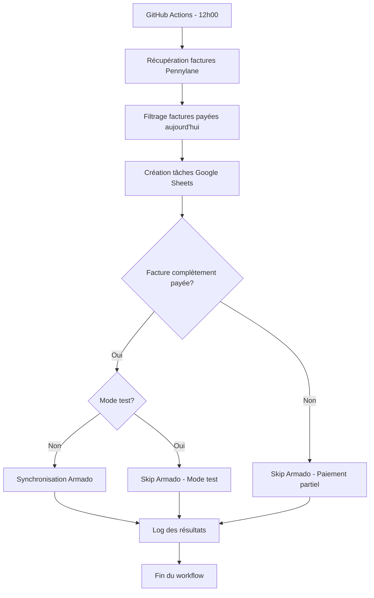

# Intégration GitHub Actions - Synchronisation Armado

## 🎯 Vue d'ensemble

Le workflow GitHub Actions a été mis à jour pour inclure la synchronisation automatique des paiements vers Armado après chaque traitement de factures Pennylane.

## 🔄 Flux de synchronisation



## 📋 Configuration requise

### Secrets GitHub

Ajoutez ces secrets dans **Settings > Secrets and variables > Actions** :

| Secret | Description | Obligatoire |
|--------|-------------|-------------|
| `PENNYLANE_API_KEY` | Clé API Pennylane v2 | ✅ |
| `ARMADO_API_KEY` | Clé API Armado | ✅ |
| `SPREADSHEET_ID` | ID Google Spreadsheet | ✅ |
| `GOOGLE_CREDENTIALS` | Contenu credentials.json | ✅ |
| `SPREADSHEET_NAME` | Nom de la feuille | ❌ (défaut: "Tâches à réaliser") |
| `ARMADO_BASE_URL` | URL API Armado | ❌ (défaut: "https://api.myarmado.fr") |
| `ARMADO_TIMEOUT` | Timeout en secondes | ❌ (défaut: "10") |

### Variables d'environnement automatiques

Le workflow configure automatiquement :

```bash
PENNYLANE_API_KEY=${{ secrets.PENNYLANE_API_KEY }}
ARMADO_API_KEY=${{ secrets.ARMADO_API_KEY }}
ARMADO_BASE_URL=${{ secrets.ARMADO_BASE_URL || 'https://api.myarmado.fr' }}
ARMADO_TIMEOUT=${{ secrets.ARMADO_TIMEOUT || '10' }}
TEST_MODE=${{ github.event.inputs.test_mode || 'false' }}
```

## 🚀 Exécution

### Automatique (planifiée)

- **Déclenchement** : Tous les jours à 12h00 heure française (11h00 UTC)
- **Cron** : `0 11 * * *`
- **Mode** : Production (synchronisation Armado activée)

### Manuelle

1. Allez dans **Actions** de votre repository
2. Sélectionnez "Synchronisation Pennylane - Google Sheets - Armado"
3. Cliquez sur **Run workflow**
4. Optionnel : Activez le mode test

### Mode test

Le mode test désactive la synchronisation Armado :

```bash
# Via l'interface GitHub Actions
test_mode: true

# Via variable d'environnement
TEST_MODE=true
```

## 📊 Jobs du workflow

### 1. `sync-pennylane-armado` (principal)

- **Objectif** : Synchronisation complète Pennylane → Google Sheets → Armado
- **Déclenchement** : Automatique + manuel
- **Étapes** :
  1. Checkout du code
  2. Configuration Python 3.11
  3. Installation des dépendances
  4. Configuration des variables d'environnement
  5. Configuration des credentials Google
  6. Test de connexion Armado (si mode production)
  7. Exécution de la synchronisation
  8. Nettoyage des credentials
  9. Rapport de synchronisation

### 2. `test-armado-integration` (tests)

- **Objectif** : Tests unitaires de l'intégration Armado
- **Déclenchement** : Manuel avec mode test activé
- **Étapes** :
  1. Checkout du code
  2. Configuration Python 3.11
  3. Installation des dépendances + pytest
  4. Configuration des variables de test
  5. Exécution des tests unitaires
  6. Test de connexion avec mock

## 🔍 Monitoring et logs

### Logs de synchronisation

```
=== Début de la synchronisation ===
Mode test: false
Date: 2024-01-15 12:00:00

=== Traitement des factures payées aujourd'hui ===
Nombre total de factures analysées: 150
  - Factures payées aujourd'hui: 3
  - Factures partiellement payées aujourd'hui: 1

  ✓ Facture 20664 traitée (Payée)
[Armado] Synchronisation: 20664 (Payée)
[Armado] ✓ Synchronisé: 20664

  ✓ Facture 20665 traitée (Partiellement payée)
  ℹ Facture partiellement payée - pas de synchronisation Armado

=== Rapport de synchronisation ===
Date d'exécution: 2024-01-15 12:05:00
Mode test: false
Statut: success
```

### Logs d'erreur

```
[Armado] ✗ Erreur: Armado: facture avec référence '20665' introuvable
  ⚠ Synchronisation Armado échouée: Armado: facture avec référence '20665' introuvable
```

## 🛠️ Dépannage

### Erreurs courantes

#### 1. Erreur d'authentification Armado

```
[Armado] ✗ Erreur: API key invalide - vérifiez ARMADO_API_KEY
```

**Solution** : Vérifiez le secret `ARMADO_API_KEY` dans GitHub

#### 2. Facture introuvable sur Armado

```
[Armado] ✗ Erreur: Armado: facture avec référence '20664' introuvable
```

**Solution** : Vérifiez que la facture existe sur Armado avec la bonne référence

#### 3. Erreur de validation

```
[Armado] ✗ Erreur: Erreur de validation Armado: Invalid payment type
```

**Solution** : Vérifiez le mapping des types de paiement dans `sync_payments.py`

### Diagnostic

#### Test de connexion

```bash
# Test local
python test_quick_armado.py

# Test via GitHub Actions (mode test)
# Activez le mode test dans l'interface GitHub Actions
```

#### Logs détaillés

Activez les logs DEBUG en modifiant temporairement le workflow :

```yaml
- name: Exécution de la synchronisation
  run: |
    export PYTHONPATH=$PYTHONPATH:.
    python -c "import logging; logging.basicConfig(level=logging.DEBUG)"
    python main.py --auto
```

## 🔧 Personnalisation

### Modifier le mode de paiement par défaut

Dans `main.py`, ligne 130 :

```python
# Déterminer le mode de paiement par défaut (à adapter selon vos besoins)
payment_mode = "virement"  # Mode par défaut, à personnaliser
```

### Ajouter de nouveaux types de paiement

Dans `sync_payments.py` :

```python
PAYMENT_TYPE_MAP = {
    "virement": 2,
    "cb": 3,
    # Ajoutez vos modes personnalisés
    "nouveau_mode": 9,
}
```

### Modifier la fréquence d'exécution

Dans `.github/workflows/pennylane-sync.yml` :

```yaml
schedule:
  - cron: '0 11 * * *'  # 12h00 heure française
  # - cron: '0 9 * * *'  # 10h00 heure française
  # - cron: '0 14 * * 1-5'  # 15h00 du lundi au vendredi
```

## 📈 Métriques et monitoring

### Suivi des synchronisations

- **Succès** : Logs avec `[Armado] ✓ Synchronisé`
- **Échecs** : Logs avec `[Armado] ✗ Erreur`
- **Mode test** : Logs avec `[Armado] Mode test - synchronisation désactivée`

### Alertes recommandées

1. **Échec de workflow** : Notification automatique GitHub
2. **Taux d'erreur Armado élevé** : Surveillez les logs
3. **Factures non synchronisées** : Implémentez une file de retry

## 🔒 Sécurité

### Bonnes pratiques

- ✅ Secrets stockés dans GitHub Secrets (chiffrés)
- ✅ Credentials Google nettoyés après chaque exécution
- ✅ Mode test disponible pour les tests
- ✅ Logs sans données sensibles

### Permissions API

Limitez les permissions de l'API key Armado :
- Lecture seule pour la recherche de factures
- Écriture limitée aux champs `paymentType` et `paymentDate`

## 🚀 Déploiement

### 1. Configuration initiale

```bash
# 1. Ajoutez les secrets GitHub
# 2. Testez localement
python test_quick_armado.py

# 3. Testez le workflow en mode test
# (via l'interface GitHub Actions)
```

### 2. Activation en production

```bash
# 1. Exécutez manuellement une première fois
# 2. Vérifiez les logs
# 3. La planification automatique est déjà active
```

### 3. Monitoring post-déploiement

- Surveillez les logs des premières exécutions
- Vérifiez que les factures sont bien synchronisées sur Armado
- Ajustez les types de paiement si nécessaire

## 📞 Support

- **Documentation complète** : `INTEGRATION_ARMADO.md`
- **Tests** : `test_armado_integration.py`
- **Diagnostic** : `test_quick_armado.py`
- **Exemples** : `tempo_armado_integration_example.py`
