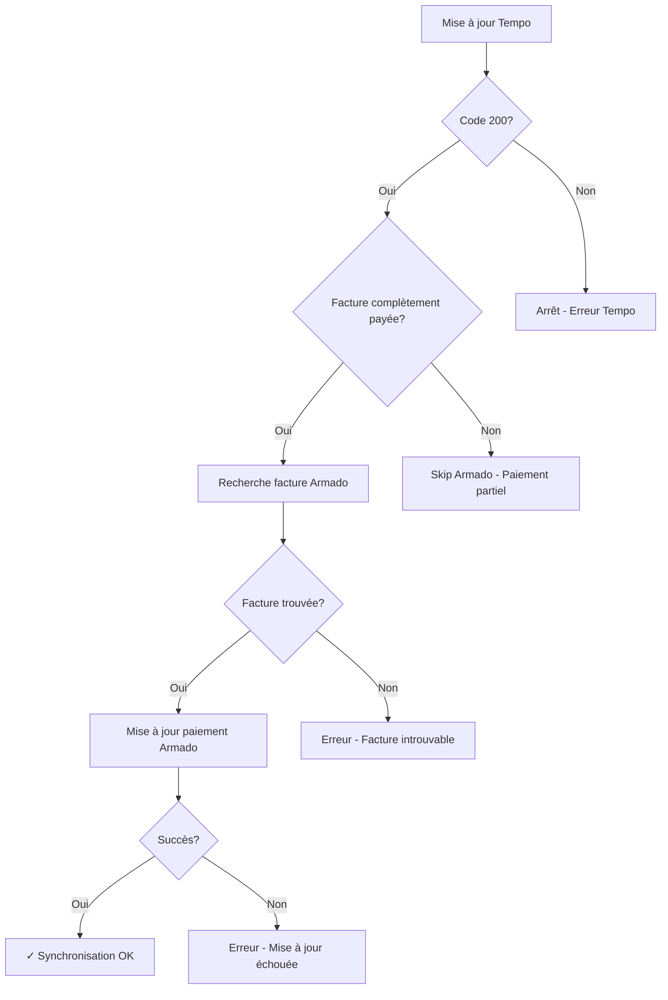

# Intégration Armado - Synchronisation des Paiements Tempo

## 🎯 Objectif

Synchroniser automatiquement les paiements de Tempo vers Armado **uniquement** quand une facture est **complètement payée**.

## 📋 Fonctionnalités

- ✅ Recherche de factures Armado par référence (numéro Tempo)
- ✅ Mise à jour des paiements avec `paymentType` et `paymentDate`
- ✅ Gestion d'erreurs robuste avec retry automatique
- ✅ Support de multiples modes de paiement
- ✅ Tests unitaires complets
- ✅ Logging détaillé

## 🚀 Installation rapide

### 1. Variables d'environnement

Copiez `env_example.txt` vers `.env` et configurez :

```bash
ARMADO_API_KEY=your_armado_api_key_here
ARMADO_BASE_URL=https://api.myarmado.fr
ARMADO_TIMEOUT=10
```

### 2. Test de connexion

```bash
python test_quick_armado.py
```

### 3. Utilisation

```python
from datetime import datetime
from sync_payments import sync_armado_after_tempo

# Après une mise à jour Tempo réussie
result = sync_armado_after_tempo(
    invoice_reference="20664",  # Numéro facture Tempo
    payment_mode="virement",    # Mode de paiement
    payment_date=datetime.now() # Date de paiement
)
```

## 📁 Fichiers créés

| Fichier | Description |
|---------|-------------|
| `armado_client.py` | Client HTTP pour l'API Armado |
| `sync_payments.py` | Module de synchronisation principal |
| `test_armado_integration.py` | Tests unitaires complets |
| `test_quick_armado.py` | Script de test rapide |
| `tempo_armado_integration_example.py` | Exemple d'intégration complète |
| `INTEGRATION_ARMADO.md` | Documentation détaillée |
| `env_example.txt` | Variables d'environnement |

## 🔧 Modes de paiement supportés

```python
PAYMENT_TYPE_MAP = {
    "virement": 2,
    "cb": 3, "carte": 3, "carte bancaire": 3,
    "cheque": 1, "chèque": 1,
    "especes": 4, "espèces": 4, "liquide": 4, "cash": 4,
    "prelevement": 5, "prélèvement": 5, "sepa": 5,
    "paypal": 6,
    "stripe": 7,
    "autre": 8, "other": 8
}
```

## 🔄 Flux de synchronisation



### Comportement

- ✅ **Facture complètement payée** → Synchronisation Armado
- ❌ **Facture partiellement payée** → Pas de synchronisation Armado  
- ✅ **Google Sheets** → Toujours mis à jour (tous statuts)

## 🛡️ Gestion d'erreurs

### Erreurs courantes

- **401** : API key invalide
- **404** : Facture introuvable sur Armado
- **422** : Données invalides (type de paiement, format de date)

### Retry automatique

- 3 tentatives maximum pour les erreurs 5xx
- Backoff exponentiel : 0.5s, 1s, 2s
- Les erreurs 4xx ne sont pas retentées

## 📊 Exemple d'intégration

```python
def process_tempo_payment(invoice_number, payment_data):
    # 1. Mise à jour Tempo
    tempo_response = update_tempo_payment(invoice_number, payment_data)
    
    if tempo_response.status_code == 200:
        # 2. Synchronisation Armado (non-bloquante)
        try:
            from sync_payments import sync_with_error_handling
            
            armado_result = sync_with_error_handling(
                invoice_reference=invoice_number,
                payment_mode=payment_data.get('mode', 'virement'),
                payment_date=datetime.now()
            )
            
            if armado_result['success']:
                print(f"[Armado] ✓ Synchronisé: {invoice_number}")
            else:
                print(f"[Armado] ✗ Erreur: {armado_result['error']}")
                
        except Exception as e:
            print(f"[Armado] ✗ Erreur inattendue: {e}")
            # Ne pas faire échouer le traitement Tempo
    
    return tempo_response
```

## 🧪 Tests

### Test rapide
```bash
python test_quick_armado.py
```

### Tests unitaires
```bash
python -m pytest test_armado_integration.py -v
```

### Test de connexion
```python
from sync_payments import test_armado_connection
test_armado_connection()
```

## 📝 Logs

Les logs incluent des préfixes pour faciliter le monitoring :

```
[Armado] Recherche de la facture avec référence: 20664
[Armado] Facture trouvée: ID=12345, référence=20664
[Armado] Mise à jour du paiement: ID=12345, type=2, date=2024-01-15T10:30:00.000000
[Armado] Paiement mis à jour avec succès: ID=12345
[Sync] ✓ Synchronisation réussie: bill_id=12345, paymentType=2, paymentDate=2024-01-15T10:30:00.000000
```

## 🔧 Configuration avancée

### Ajout de nouveaux modes de paiement

```python
from sync_payments import add_payment_mode_mapping
add_payment_mode_mapping('nouveau_mode', 9)
```

### Timeout personnalisé

```bash
ARMADO_TIMEOUT=15  # 15 secondes au lieu de 10
```

### Logging détaillé

```python
import logging
logging.basicConfig(level=logging.DEBUG)
```

## 🚨 Points d'attention

1. **Non-bloquant** : Les erreurs Armado ne doivent pas faire échouer le flux Tempo
2. **API key** : Stockez-la dans les variables d'environnement, jamais dans le code
3. **Monitoring** : Surveillez les logs pour détecter les problèmes
4. **Retry** : Implémentez une file de retry pour les échecs temporaires

## 📞 Support

- Consultez `INTEGRATION_ARMADO.md` pour la documentation complète
- Utilisez `test_quick_armado.py` pour diagnostiquer les problèmes
- Vérifiez les logs avec les préfixes `[Armado]` et `[Sync]`

## 🎉 Prêt à l'emploi !

L'intégration est maintenant prête. Ajoutez simplement l'appel à `sync_armado_after_tempo()` après vos mises à jour Tempo réussies.
